# FilesFence Rendering Sequence Diagram

## Overview
This diagram shows the complete data flow from when `FilesFenceHandlerWpf.Refresh()` is called until items are rendered on screen with icons, metadata, and badges.

## Sequence Diagram

```mermaid
sequenceDiagram
    participant User
    participant FenceContainer
    participant FilesFenceHandlerWpf
    participant GetInstalledItems
    participant FileFenceFilter
    participant EnhancedInstalledAppsService
    participant InstalledSoftware
    participant ExtractIconFromSoftware
    participant ThumbnailProvider
    participant IconUtil
    participant FileItemViewModel
    participant ObservableCollection
    participant WPF_ItemsControl
    participant FileItemTemplateBuilder
    participant UI_Grid

    Note over User,UI_Grid: User triggers refresh (or auto-refresh on thumbnail load)

    User->>FenceContainer: Mouse hover / Display change
    FenceContainer->>FilesFenceHandlerWpf: Refresh()

    Note over FilesFenceHandlerWpf: Clear existing items
    FilesFenceHandlerWpf->>ObservableCollection: items.Clear()

    Note over FilesFenceHandlerWpf: Check if installedItems cache is empty
    alt installedItems.Count == 0
        FilesFenceHandlerWpf->>GetInstalledItems: GetInstalledItems()

        Note over GetInstalledItems: Determine filter type
        alt Smart Filter (fenceInfo.Filter != null)
            GetInstalledItems->>FileFenceFilter: ApplyFilter(filter, path, items)

            alt FilterType == Software
                FileFenceFilter->>EnhancedInstalledAppsService: GetByCategoryEnhanced(category)
                EnhancedInstalledAppsService-->>FileFenceFilter: List<InstalledSoftware> (from DB)
                Note over FileFenceFilter: Filter valid paths<br/>(ExecutablePath or InstallLocation exists)
                FileFenceFilter-->>GetInstalledItems: FilterResult.SoftwareItems
            else FilterType == Category/Extensions/Pattern
                FileFenceFilter->>FileFenceFilter: Directory.GetFileSystemEntries(path)
                loop For each file path
                    FileFenceFilter->>InstalledSoftware: InstalledSoftware.FromPath(path)
                    InstalledSoftware-->>FileFenceFilter: InstalledSoftware object
                end
                FileFenceFilter-->>GetInstalledItems: FilterResult.FileItems
            end

            GetInstalledItems->>GetInstalledItems: Combine SoftwareItems + FileItems
            GetInstalledItems-->>FilesFenceHandlerWpf: List<InstalledSoftware>

        else Legacy Filter (old Filters list)
            GetInstalledItems->>GetInstalledItems: Directory.GetFileSystemEntries(path)
            loop For each pattern in Filters
                GetInstalledItems->>FileFenceFilter: MatchesPattern(path, pattern)
                FileFenceFilter-->>GetInstalledItems: bool
                alt Pattern matches
                    GetInstalledItems->>InstalledSoftware: InstalledSoftware.FromPath(path)
                    InstalledSoftware-->>GetInstalledItems: InstalledSoftware object
                end
            end
            GetInstalledItems-->>FilesFenceHandlerWpf: List<InstalledSoftware>

        else Manual Items (fenceInfo.Items)
            loop For each item path
                GetInstalledItems->>InstalledSoftware: InstalledSoftware.FromPath(path)
                InstalledSoftware-->>GetInstalledItems: InstalledSoftware object
            end
            GetInstalledItems-->>FilesFenceHandlerWpf: List<InstalledSoftware>
        end

        FilesFenceHandlerWpf->>FilesFenceHandlerWpf: Store in installedItems cache
    end

    Note over FilesFenceHandlerWpf: Process each InstalledSoftware item
    loop For each software in installedItems
        FilesFenceHandlerWpf->>FilesFenceHandlerWpf: Get cachePath (ExecutablePath ?? InstallLocation)

        Note over FilesFenceHandlerWpf: Check icon cache (PERFORMANCE KEY!)
        alt Icon in extractedIconCache
            FilesFenceHandlerWpf->>FilesFenceHandlerWpf: Retrieve cached BitmapSource
            Note over FilesFenceHandlerWpf: ✅ 50-100x faster - skip extraction!
        else Icon NOT cached
            FilesFenceHandlerWpf->>ExtractIconFromSoftware: ExtractIconFromSoftware(software)

            Note over ExtractIconFromSoftware: Priority 1: Use cached GDI+ icon
            alt software.CachedIcon != null
                ExtractIconFromSoftware->>ExtractIconFromSoftware: Use software.CachedIcon
            else Priority 2: IconPath exists
                ExtractIconFromSoftware->>IconUtil: Icon.ExtractAssociatedIcon(IconPath)
                IconUtil-->>ExtractIconFromSoftware: Icon (GDI+)
                ExtractIconFromSoftware->>InstalledSoftware: software.CachedIcon = icon
            else Priority 3: ExecutablePath
                alt Thumbnail supported
                    ExtractIconFromSoftware->>ThumbnailProvider: GenerateThumbnail(ExecutablePath)
                    ThumbnailProvider-->>ExtractIconFromSoftware: Icon (GDI+)
                else Standard extraction
                    ExtractIconFromSoftware->>IconUtil: Icon.ExtractAssociatedIcon(ExecutablePath)
                    IconUtil-->>ExtractIconFromSoftware: Icon (GDI+)
                end
                ExtractIconFromSoftware->>InstalledSoftware: software.CachedIcon = icon
            else Priority 4: InstallLocation (folder)
                ExtractIconFromSoftware->>IconUtil: IconUtil.FolderLarge
                IconUtil-->>ExtractIconFromSoftware: Icon (GDI+)
            else Fallback: Default icon
                ExtractIconFromSoftware->>IconUtil: IconUtil.DocumentFile
                IconUtil-->>ExtractIconFromSoftware: Icon (GDI+)
            end

            Note over ExtractIconFromSoftware: Convert GDI+ Icon to WPF BitmapSource
            ExtractIconFromSoftware->>ExtractIconFromSoftware: Imaging.CreateBitmapSourceFromHIcon()
            ExtractIconFromSoftware->>ExtractIconFromSoftware: ImagePreprocessor.PreprocessImage()
            ExtractIconFromSoftware-->>FilesFenceHandlerWpf: BitmapSource

            Note over FilesFenceHandlerWpf: Cache for next refresh!
            FilesFenceHandlerWpf->>FilesFenceHandlerWpf: extractedIconCache[cachePath] = icon
        end

        Note over FilesFenceHandlerWpf: Create ViewModel with ALL metadata
        FilesFenceHandlerWpf->>FileItemViewModel: FromInstalledSoftware(software, icon)
        FileItemViewModel->>FileItemViewModel: Set Name, Path, Icon<br/>Publisher, Version, InstallDate<br/>Source, Category
        FileItemViewModel->>FileItemViewModel: Calculate IsRecentlyInstalled<br/>(< 7 days old)
        FileItemViewModel->>FileItemViewModel: Build Tooltip<br/>(Name, Publisher, Version, etc.)
        FileItemViewModel-->>FilesFenceHandlerWpf: FileItemViewModel

        FilesFenceHandlerWpf->>ObservableCollection: items.Add(viewModel)
    end

    Note over FilesFenceHandlerWpf: Raise ContentChanged event
    FilesFenceHandlerWpf->>FenceContainer: ContentChanged event
    FenceContainer->>FenceContainer: Adjust auto-height if needed

    Note over WPF_ItemsControl: WPF data binding triggers UI update
    ObservableCollection->>WPF_ItemsControl: CollectionChanged event

    loop For each FileItemViewModel
        WPF_ItemsControl->>FileItemTemplateBuilder: Apply ItemTemplate
        Note over FileItemTemplateBuilder: Template structure created once<br/>at initialization

        FileItemTemplateBuilder->>UI_Grid: Create Grid container
        UI_Grid->>UI_Grid: Create StackPanel (icon + text)
        UI_Grid->>UI_Grid: Bind Icon to Image (48x48)
        UI_Grid->>UI_Grid: Bind Name to TextBlock (max 2 lines)
        UI_Grid->>UI_Grid: Bind Tooltip property

        Note over UI_Grid: Session 11: Add "NEW" badge
        alt IsRecentlyInstalled == true
            UI_Grid->>UI_Grid: Create Badge Border (green)
            UI_Grid->>UI_Grid: Position top-right corner
            UI_Grid->>UI_Grid: Add "NEW" TextBlock
        end

        UI_Grid-->>WPF_ItemsControl: Rendered Border with Grid
    end

    Note over WPF_ItemsControl: Items laid out in WrapPanel
    WPF_ItemsControl->>User: Display updated fence with icons + badges
```



## Key Components

### 1. **FilesFenceHandlerWpf.Refresh()**
- **Purpose**: Main entry point for refreshing fence content
- **Location**: `NoFences/View/Canvas/Handlers/FilesFenceHandlerWpf.cs:101-145`
- **Responsibilities**:
  - Clear existing items
  - Load installed items (with caching)
  - Extract/cache icons
  - Create ViewModels with metadata
  - Raise ContentChanged event

### 2. **GetInstalledItems()**
- **Purpose**: Get software/files based on fence configuration
- **Location**: `NoFences/View/Canvas/Handlers/FilesFenceHandlerWpf.cs:147-209`
- **Returns**: `List<InstalledSoftware>` with full metadata
- **Handles 3 scenarios**:
  1. Smart filter (software category, extensions, pattern)
  2. Legacy filter (old Filters list)
  3. Manual items (fenceInfo.Items)

### 3. **FileFenceFilter.ApplyFilter()**
- **Purpose**: Apply filtering logic to get items
- **Location**: `NoFences/Util/FileFenceFilter.cs:38-78`
- **Returns**: `FilterResult` with `SoftwareItems` + `FileItems`
- **Filter types**:
  - Software: Queries database via `EnhancedInstalledAppsService`
  - File-based: Scans directory with pattern matching

### 4. **ExtractIconFromSoftware()**
- **Purpose**: Extract icon with smart fallback logic
- **Location**: `NoFences/View/Canvas/Handlers/FilesFenceHandlerWpf.cs:211-301`
- **Icon extraction priority**:
  1. Cached GDI+ icon (`software.CachedIcon`)
  2. Pre-extracted IconPath (Steam, GOG games)
  3. ExecutablePath (with thumbnail support)
  4. InstallLocation (folder icon)
  5. Default document icon (fallback)
- **Performance**: Icons cached in `extractedIconCache` (50-100x speedup)

### 5. **FileItemViewModel.FromInstalledSoftware()**
- **Purpose**: Create ViewModel with all metadata
- **Location**: `NoFences/View/Canvas/Handlers/FilesFenceHandlerWpf.cs:397-410`
- **Properties set**:
  - Display: Name, Path, Icon
  - Metadata: Publisher, Version, InstallDate, Source, Category
  - UI helpers: IsRecentlyInstalled, Tooltip

### 6. **FileItemTemplateBuilder.Create()**
- **Purpose**: Create WPF DataTemplate for rendering
- **Location**: `NoFences/Util/FileItemTemplateBuilder.cs:27-118`
- **Template structure**:
  - Border container (80x100px)
  - Grid with StackPanel (icon + text)
  - "NEW" badge (top-right, conditional)
  - Tooltip binding
  - Mouse hover effects

## Performance Optimizations (Session 11)

### Icon Caching
```
FIRST REFRESH (100 games):
- extractedIconCache: EMPTY
- ExtractIcon called: 100 times (slow!)
- Time: ~2-5 seconds

SECOND REFRESH (100 games):
- extractedIconCache: 100 entries
- ExtractIcon called: 0 times
- Cache hits: 100 (instant!)
- Time: ~0.02-0.05 seconds
- SPEEDUP: 50-100x faster!
```

### Data Flow Optimization
**Before Session 11:**
```
Database → List<string> paths → FenceEntry → ExtractIcon (EVERY TIME)
❌ Metadata lost
❌ Icons re-extracted every refresh
```

**After Session 11:**
```
Database → List<InstalledSoftware> → ExtractIcon (ONCE) → Cache
✅ All metadata preserved
✅ Icons cached across refreshes
```

## Data Structures

### InstalledSoftware (Enhanced in Session 11)
```csharp
public class InstalledSoftware
{
    // Display
    public string Name { get; set; }
    public string ExecutablePath { get; set; }
    public string InstallLocation { get; set; }
    public string IconPath { get; set; }

    // Metadata (preserved!)
    public string Publisher { get; set; }
    public string Version { get; set; }
    public DateTime? InstallDate { get; set; }
    public SoftwareCategory Category { get; set; }

    // Session 11: New properties
    public string Source { get; set; }  // Local, Steam, GOG, etc.
    public Icon CachedIcon { get; set; } // GDI+ icon cache

    // Factory methods
    public static InstalledSoftware FromPath(string path);
}
```

### FileItemViewModel (Enhanced in Session 11)
```csharp
public class FileItemViewModel
{
    // Display
    public string Name { get; set; }
    public string Path { get; set; }
    public BitmapSource Icon { get; set; }

    // Session 11: Metadata
    public string Publisher { get; set; }
    public string Version { get; set; }
    public DateTime? InstallDate { get; set; }
    public string Source { get; set; }
    public SoftwareCategory Category { get; set; }

    // UI helpers
    public bool IsRecentlyInstalled { get; }
    public bool IsSteam { get; }
    public bool IsEpic { get; }
    public bool IsGOG { get; }
    public string Tooltip { get; }

    // Factory
    public static FileItemViewModel FromInstalledSoftware(software, icon);
}
```

### FilterResult (Refactored in Session 11)
```csharp
public class FilterResult
{
    public List<InstalledSoftware> SoftwareItems { get; set; } // From database
    public List<InstalledSoftware> FileItems { get; set; }     // From filesystem
    public List<InstalledSoftware> AllItems { get; }           // Combined
}
```

## Trigger Points

### When Refresh() is Called
1. **Initial display**: `CreateContentElement()` → `Refresh()`
2. **Thumbnail loaded**: `ThumbnailProvider_IconThumbnailLoaded()` → `Refresh()`
3. **Manual refresh**: External trigger → `Refresh()`

### WPF Data Binding
- `ObservableCollection<FileItemViewModel>` triggers UI updates automatically
- WPF ItemsControl applies template to each item
- Template bindings: `{Binding Icon}`, `{Binding Name}`, `{Binding Tooltip}`, etc.

## Example Flow for 1 Item

### Steam Game Example: "Portal 2"
```
1. Refresh() called
2. GetInstalledItems()
   → FileFenceFilter.ApplyFilter(Software, Games)
   → EnhancedInstalledAppsService.GetByCategoryEnhanced(Games)
   → Returns: InstalledSoftware {
       Name: "Portal 2",
       ExecutablePath: "C:\Program Files\Steam\steamapps\common\Portal 2\portal2.exe",
       IconPath: "C:\Program Files\Steam\steam\games\portal2.ico",
       Publisher: "Valve Corporation",
       Version: "2.0.0.1",
       InstallDate: 2024-12-15,
       Source: "Steam",
       Category: Game
     }
3. Check extractedIconCache["C:\...\portal2.exe"]
   → MISS (first time)
4. ExtractIconFromSoftware(software)
   → Try IconPath: "C:\...\portal2.ico" → SUCCESS
   → Icon.ExtractAssociatedIcon() → GDI+ Icon
   → CreateBitmapSourceFromHIcon() → WPF BitmapSource
   → ImagePreprocessor.PreprocessImage() → Final BitmapSource
5. Cache: extractedIconCache["C:\...\portal2.exe"] = bitmapSource
6. FileItemViewModel.FromInstalledSoftware()
   → Creates ViewModel with:
      - Icon: BitmapSource (Portal 2 icon)
      - Name: "Portal 2"
      - Publisher: "Valve Corporation"
      - Version: "2.0.0.1"
      - InstallDate: 2024-12-15
      - Source: "Steam"
      - IsRecentlyInstalled: false (> 7 days)
      - Tooltip: "Portal 2\nPublisher: Valve Corporation\nVersion: 2.0.0.1\nInstalled: 2024-12-15\nSource: Steam\nPath: C:\...\portal2.exe"
7. items.Add(viewModel)
8. WPF binds ViewModel to template
9. Rendered:
   - 48x48 icon (Portal 2 logo)
   - "Portal 2" text (2 lines max)
   - No badge (not recently installed)
   - Hover shows rich tooltip
```

### SECOND Refresh (same game)
```
1. Refresh() called
2. installedItems cache: NOT EMPTY → Skip GetInstalledItems()
3. Check extractedIconCache["C:\...\portal2.exe"]
   → HIT! (cached from before)
   → Return cached BitmapSource instantly
4. Create ViewModel (< 1ms)
5. items.Add(viewModel)
6. Render complete

PERFORMANCE: ~100x faster (no Win32 icon extraction!)
```

## Summary

### Data Flow (High Level)
```
User Action
    ↓
Refresh()
    ↓
GetInstalledItems() ← FileFenceFilter ← Database/Filesystem
    ↓
List<InstalledSoftware> (with full metadata)
    ↓
For each software:
    ↓
    Check Icon Cache → ExtractIcon (if needed) → Cache
    ↓
    Create FileItemViewModel (with metadata)
    ↓
    Add to ObservableCollection
    ↓
WPF Data Binding
    ↓
FileItemTemplateBuilder applies template
    ↓
UI Rendered (icon + text + badge + tooltip)
```

### Key Benefits of Session 11 Refactoring
1. ✅ **Single source of truth**: InstalledSoftware throughout pipeline
2. ✅ **Metadata preservation**: Publisher, Version, InstallDate available in UI
3. ✅ **Icon caching**: 50-100x performance improvement on refreshes
4. ✅ **Rich tooltips**: All metadata displayed on hover
5. ✅ **Badge system**: "NEW" badges for recently installed items
6. ✅ **Centralized template**: One place to modify UI (FileItemTemplateBuilder)
